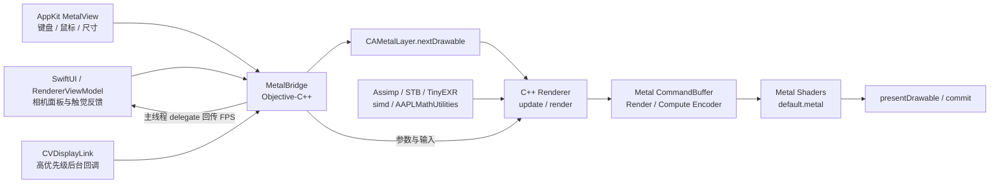
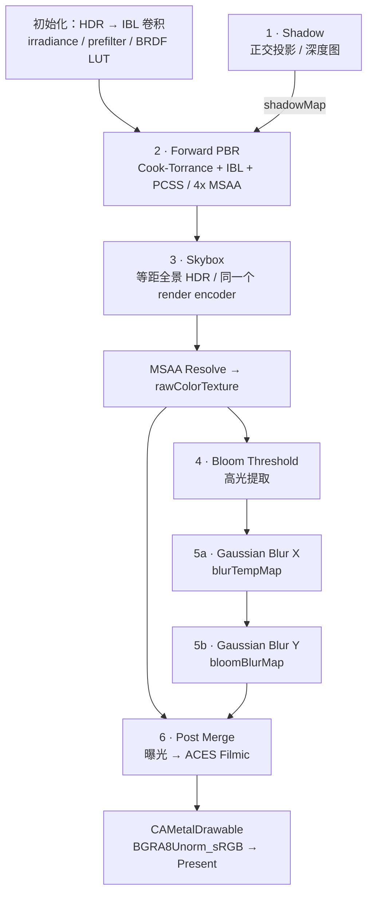

# Metal-CPP 实时渲染引擎 · 工程开发规范

> **平台** macOS / Apple Silicon / arm64　·　**语言** Swift、Objective-C++、C++20、MSL  
> **原则** 接口可验证 · 资源有归属 · 帧内少开销 · 变更可追溯

本文统一架构边界、Git 工作流、CPU/GPU 数据契约和交付标准。**必须 / 禁止**为硬性规则；**建议**为默认工程选择。现状依据为 `main@c685515`（核对日期：2026-09-25）；路线图描述待完成工作，不代表代码已符合全部规范。

## 导航

1. [🏗️ 项目架构与数据流向](#architecture)
2. [🌿 Git 分支管理与工作流](#workflow)
3. [📝 Commit 提交信息规范](#commits)
4. [⚡️ Metal 引擎开发铁律](#hard-rules)
5. [🔍 常见排错与调试 Checklist](#troubleshooting)
6. [🧭 后续功能路线图](#roadmap)
7. [✅ 交付门禁与维护依据](#delivery)

---

<a id="architecture"></a>
## 1. 🏗️ 项目架构与数据流向 · Architecture Blueprint

### 1.1 分层职责与真实入口

| 层级 | 代码入口 | 职责与边界 |
| :--- | :--- | :--- |
| UI / 交互 | `swift_Bridge/contentView.swift`、`rendererViewModel.swift`、`_physical_camera_action.swift` | SwiftUI 状态、拟物相机面板、AppKit 触觉反馈；不直接管理 GPU 资源 |
| 视图 / 桥接 | `swift_Bridge/metalViewRepresentable.swift`、`metalview.mm`、`metalBridge.h/.mm` | NSView、CAMetalLayer、键鼠事件、CVDisplayLink、Swift 与 C++ 类型边界 |
| 引擎 | `swift_Bridge/renderer.hpp/.mm` | C++ `Renderer`、帧更新、资源创建、Pass 编码；实现文件因互操作使用 `.mm` |
| 场景 / 资产 / 数学 | `Realtime Renderer Based on Metal-CPP/include/`、`src/` | Model、Scene、Camera；Assimp、STB、TinyEXR；Apple simd / AAPLMathUtilities |
| GPU | `Realtime Renderer Based on Metal-CPP/default.metal` | PBR、PCSS、IBL 预计算、天空盒和后处理；当前集中于单个文件 |
| 原生独立入口 | `Realtime Renderer Based on Metal-CPP/main.mm` | 独立原生目标的渲染流程；与 Swift App 存在重复实现，需要同步接口 |



**线程契约：** UI 与 AppKit 操作留在主线程；`CVDisplayLink` 回调使用 `@autoreleasepool`，获取 drawable 后驱动引擎。当前 `_keys`、相机参数和鼠标操作仍直接跨线程访问引擎，不能因缓存了 `CAMetalLayer` 就宣称整体线程安全。后续必须通过输入队列或受同步保护的快照，在帧边界统一消费；停止回调并确认无在途访问后才销毁引擎。

### 1.2 一帧的六个逻辑阶段



| 阶段 | 输入 → 输出 | 当前实现要点 |
| :--- | :--- | :--- |
| Shadow | 场景几何、正交光源矩阵 → `_shadowMap` | `Depth32Float`，2048 × 2048，Clear / Store；只写深度。PCSS 遮挡搜索及过滤在 Forward 中执行 |
| Forward PBR | 材质、多光源、IBL、阴影 → MSAA HDR Color / Depth | `RGBA16Float` 颜色与 `Depth32Float` 深度，4x MSAA |
| Skybox | 去平移视图矩阵、全景 HDR → 同一 MSAA Color | 在 Forward encoder 内切换 PSO；LessEqual 深度测试，不写深度 |
| Bloom Threshold | `_rawColorTexture` → `_bloomThresholdMap` | 当前亮度阈值为 `2.0f`；在曝光前提取 |
| Gaussian Blur | Threshold → `_blurTempMap` → `_bloomBlurMap` | 一个 compute encoder 中先 X 后 Y 两次 dispatch；输入输出分离 |
| Post Merge | 原始 HDR + Bloom → drawable | 手动 / 物理曝光两套 PSO，共用 `CameraPostParams`，最后 ACES |

六个逻辑阶段不等于六个 render encoder：当前一帧为 **4 个 render encoder + 1 个 compute encoder（2 次 dispatch）**。Forward 与 Skybox 完成后才 resolve；MSAA 深度当前 `DontCare`，未输出可供 DoF 使用的场景深度。IBL 属于预计算，不应进入常规逐帧路径。

物理曝光沿用当前 Shader 约定：`EV100 = log2(N² / t) - log2(ISO / 100)`，`finalEV = EV100 - evComp`，曝光倍率为 `1 / (1.2 × 2^finalEV)`；快门 `t` 的单位是秒。输入必须为正且有限，曝光补偿 +1 应使色调映射前亮度翻倍。当前光圈参与曝光，**尚未实现景深**。

<a id="workflow"></a>
## 2. 🌿 Git 分支管理与工作流 · Branching & Workflow

### 2.1 强制命名规则

分支必须采用 `<prefix>/<name>` 斜杠分组。禁止空格、冒号、反引号；新分支名称统一小写英文、数字与短横线，禁止用 shell 特殊字符表达任务。

| 前缀 | 用途 | 示例 |
| :--- | :--- | :--- |
| `feature/` | 新功能 | `feature/dof-camera` |
| `fix/` | 缺陷修复 | `fix/struct-alignment` |
| `refactor/` | 结构调整 | `refactor/ring-buffer` |
| `sync/` | 入口与桥接同步 | `sync/swift-bridge` |
| `perf/` | 性能优化 | `perf/memoryless` |
| `docs/`、`chore/` | 文档、构建维护 | `docs/development-guide` |
| `codex/` | Codex 自动化开发分支 | `codex/struct-alignment` |

新分支校验表达式：`^(feature|fix|refactor|sync|perf|docs|chore|codex)/[a-z0-9]+(-[a-z0-9]+)*$`。同时使用 `git check-ref-format --branch` 检查 Git 引用合法性。既有 `sync/command_line_target_To_swift_bridge` 是历史命名，不作为新分支模板，也不为统一格式擅自删除或改写。

### 2.2 完整生命周期 SOP

以下以 `fix/struct-alignment` 为例；执行每一步前确认上一条命令成功。工作区不干净时先保存自己的工作，不使用强制切换或清理命令。

**① 从最新 main 创建分支**

```bash
git status --short
git checkout main
git fetch origin
git merge --ff-only origin/main
git checkout -b fix/struct-alignment
```

若 `--ff-only` 失败，先查看 `git log --oneline --graph --decorate --all`，明确分叉来源；不得用 `reset --hard` 覆盖本地工作。

**② 开发、验证、阶段性提交**

```bash
git diff
git add -- swift_Bridge/renderer.hpp "Realtime Renderer Based on Metal-CPP/default.metal"
git diff --cached --check
git diff --cached
git commit -m "fix(renderer): align CameraPostParams with Metal shader layout"
```

按单一工程意图提交，只暂存本次修改。接口变更必须在同一提交中更新 CPU、MSL 和所有调用入口；禁止把未配套的 Shader 改动作为可运行检查点。

**③ 回到 main，选择一种合并方式**

```bash
git checkout main
git fetch origin
git merge --ff-only origin/main
git merge --ff-only fix/struct-alignment
```

以上为默认快进方式，保留开发提交且不增加合并提交。需要保留功能分支边界时，最后一条改为：

```bash
git merge --no-ff fix/struct-alignment -m "chore(merge): integrate shader alignment fix"
```

若 main 已前进导致功能分支不能快进，先在功能分支合入 main、解决冲突并重新验证，再回 main 合并。不要把快进失败当作可跳过验证的理由；已共享分支不得擅自 rebase 后强推。

**④ 验证合并结果并推送**

```bash
git status --short
git log -5 --oneline
git push origin main
```

推送被拒绝时，重新 fetch、整合远端变更并验证；禁止强推 `main`。若远端启用保护规则，则通过 PR 完成同一集成流程，遵守仓库门禁。

**⑤ 安全清理本地已合并分支**

```bash
git branch --merged main
git merge-base --is-ancestor fix/struct-alignment main
git branch -d fix/struct-alignment
```

只在推送成功、祖先检查返回 0 后删除本次临时分支。禁止批量删除不明分支或使用 `-D` 绕过检查；远端分支清理是独立操作，不包含在本地清理中。

<a id="commits"></a>
## 3. 📝 Commit 提交信息规范 · Conventional Commits

强制格式：**`<type>(<scope>): <subject>`**。本项目要求 scope 不省略；主题用简短祈使句描述结果，不写泛化的 “update” 或 “fix bugs”。必要时正文说明原因、兼容性和验证结果；不兼容变更在正文添加 `BREAKING CHANGE:`。

| type | 定义 | 项目提交示例（规范示例，并非全部已发生） |
| :--- | :--- | :--- |
| `feat` | 新功能 | `feat(camera): add aperture-driven depth of field` |
| `fix` | 修复错误 | `fix(model): retain copied material textures exactly once` |
| `refactor` | 保持预期行为的重构 | `refactor(shaders): split PBR and shadow modules` |
| `perf` | 降低时间或资源成本 | `perf(renderer): reuse uniform buffers across frames` |
| `docs` | 文档修改 | `docs(workflow): document safe branch cleanup` |
| `chore` | 构建、依赖、工具维护 | `chore(build): constrain both targets to arm64` |

建议 scope：`renderer`、`shaders`、`camera`、`model`、`bridge`、`ui`、`assets`、`build`、`workflow`。分支 `feature/` 对应提交类型 `feat`；`sync/` 不新增提交类型，按实际变更使用 `fix(bridge)` 或 `refactor(bridge)`。

历史 `c685515` 的真实主题为 `fix: sync main.mm with multi-light setup and CameraPostParams buffer`；它说明双入口同步的重要性，但缺少 scope。新提交应写为 `fix(renderer): sync native entry with multi-light and camera buffers`，无需为格式统一重写历史。

<a id="hard-rules"></a>
## 4. ⚡️ Metal 引擎开发铁律 · Engine Best Practices & Hard Rules

### 4.1 CPU ↔ GPU 内存布局必须一致

**字段顺序、类型宽度、总大小、字段偏移和 padding 必须 100% 一致。** 不得只对比字段名，也不得只在一端添加 `alignas` 或使用 packed 结构体掩盖问题。特别注意 `float3` 与 `packed_float3` 的区别；共享整数使用明确位宽，禁止把 C++ `bool` 直接当作 MSL `int` 上传。

当前 `CameraPostParams` 在 `renderer.hpp`、`main.mm`、`default.metal` 各有一份定义，其标量布局契约如下：

| 字段 | C++ / MSL 当前类型 | 字节偏移 | 字节数 |
| :--- | :--- | ---: | ---: |
| `manualExposure` | float | 0 | 4 |
| `aperture` | float | 4 | 4 |
| `shutterSpeed` | float | 8 | 4 |
| `iso` | float | 12 | 4 |
| `evComp` | float | 16 | 4 |
| `isPhysicalMode` | int（目标平台为 32 位） | 20 | 4 |
| `pad[2]` | float[2] | 24 | 8 |
| **总计** | **标量自然对齐 4 字节** | — | **32** |

`pad[2]` 使总大小为 32 字节，不等于类型自动获得 16 字节对齐。建议在共享头或 CPU 定义旁加入编译期检查（以下为待落实示例）：

```cpp
#include <cstddef>
#include <type_traits>
static_assert(std::is_standard_layout_v<CameraPostParams>);
static_assert(sizeof(float) == 4 && sizeof(int) == 4);
static_assert(sizeof(CameraPostParams) == 32);
static_assert(alignof(CameraPostParams) == 4);
static_assert(offsetof(CameraPostParams, isPhysicalMode) == 20);
static_assert(offsetof(CameraPostParams, pad) == 24);
```

其他字段也应逐一校验偏移；这些断言只能验证 CPU 侧，仍须核对 MSL 定义和抓帧中的绑定长度。上传使用 `sizeof(CameraPostParams)`，禁止向期望整块参数的 `buffer(0)` 只传一个曝光 float。所有字段及 padding 初始化后再上传，物理模式开启前必须有有效的光圈、快门与 ISO。

### 4.2 稳态渲染循环零资源分配

**禁止在 `Renderer::render()` 稳态逐帧、逐模型、逐 submesh 路径中高频 `newBuffer` / `release()`。** 当前 Shadow、Forward 的 Uniform 和 lightBuffer 仍逐帧创建，属于明确技术债；不能把现状当作新代码范例。

统一演进到 **Ring Buffer / Dynamic Uniform**：初始化或容量变更时分配；按在途帧槽位写入相机、灯光和对象参数；draw 只切换 buffer offset。建议从三帧槽位起步，最终数量以实际在途帧限制为准。

- 每个槽位必须等对应 GPU 命令完成后才能复用，禁止只做 `frameIndex % 3` 而无完成同步。
- offset 必须满足所用 Metal API 与设备的对齐要求；结构体大小、数组 stride 和绑定 offset 对齐是不同概念。
- `_cameraBuffer` 当前是共享单缓冲且逐帧覆盖，也要纳入在途帧保护。
- 对象 / 灯光数量变化触发受控扩容；尺寸变化触发受控纹理重建。不得每帧重复创建纹理、PSO 或 IBL。
- 不把正常创建 command buffer / encoder 与“反复分配持久 GPU 资源”混为一谈；小参数当前使用的 `setFragmentBytes` 不是 `newBuffer` 热点。

`commit()` 不代表 GPU 已完成。默认 command buffer 的资源保留机制可保护已编码资源，因此提交后释放自己的引用不能直接判定为悬空；但它不能防止 CPU 提前覆盖共享内存。不得用全局每帧 `waitUntilCompleted()` 代替正确的在途帧管理。

### 4.3 Tile Memory 优先，跨 Pass 数据必须保留

仅在单个 render pass 内使用的 MSAA Color / Depth，优先配置 **`MTLStorageModeMemoryless`**（metal-cpp：`MTL::StorageModeMemoryless`）。当前 `initTextures()` 尚未显式配置 memoryless；此项是待落实规范。[Apple memoryless 说明](https://developer.apple.com/documentation/metal/mtlresourceoptions/storagemodememoryless)

| 资源 | 推荐 storage / store 策略 | 原因 |
| :--- | :--- | :--- |
| `_msaaRawColorTexture` | Memoryless / MultisampleResolve | resolve 到可持久访问的 `_rawColorTexture`，无需保存 MSAA 样本 |
| `_msaaDepthTexture` | Memoryless / DontCare | 当前仅 Forward + Skybox 使用，结束后丢弃 |
| `_rawColorTexture`、Bloom 中间纹理 | Private，并配置必要读写 usage | 后续 render / compute 阶段仍需访问 |
| `_shadowMap` | Private / Store | Forward 需要采样阴影深度 |
| HDR / IBL 纹理 | 按上传与预计算需求配置持久存储 | 跨帧采样，不能 memoryless |

Memoryless 不用于后续 Pass 的普通纹理读取，也不能依赖上一 Pass 的 Load。MSAA Color 使用 resolve store action 后只保留 resolve 结果；重用 texture descriptor 时必须显式重设 storage、usage、sampleCount，避免把 memoryless 误传给后处理目标。[Apple MSAA resolve 说明](https://developer.apple.com/documentation/metal/mtlstoreaction/multisampleresolve)

未来 DoF 需要可采样的场景深度时，必须重新设计深度输出 / resolve 路径，不得继续沿用“深度无后续消费者”的假设。

### 4.4 架构锁定与构建入口

已核对 `assimp/lib/libassimp.5.4.3.dylib` 为 **Mach-O arm64**；链接别名包括 `libassimp.5.dylib`。两个目标的 Debug / Release 必须锁定 `ARCHS = arm64`；`ONLY_ACTIVE_ARCH=YES` 不能替代架构锁定，禁止通过 Rosetta / x86_64 目标链接现有依赖。

当前 `project.pbxproj` 未显式设置 `ARCHS`，因此不能宣称已锁定。项目使用 `gnu++20`；App target 当前 deployment target 为 26.4，原生目标为 26.0，项目级为 26.2；以目标解析后的构建设置为准，不在未验证时擅自降低系统版本。

在仓库根目录执行以下检查 / 构建（文档命令，不代表本次已构建成功）：

```bash
file assimp/lib/libassimp.5.4.3.dylib
xcodebuild -list -project "Realtime Renderer Based on Metal-CPP.xcodeproj"
xcodebuild -project "Realtime Renderer Based on Metal-CPP.xcodeproj" \
  -scheme RealtimeRendererApp -configuration Debug \
  -destination 'platform=macOS,arch=arm64' ARCHS=arm64 ONLY_ACTIVE_ARCH=YES build
```

另一共享 scheme 为 `Realtime Renderer Based on Metal-CPP`。涉及共享模型、相机、MSL 或桥接同步时必须同时验证两者；Release 也应单独检查架构与动态库嵌入、签名、运行时搜索路径。

### 4.5 所有权、代码风格与颜色约定

- 持有型指针初始化为 `nullptr`；`new/alloc/copy/retain` 获取的引用有且只有一次对应释放责任。禁止有析构释放逻辑却依赖隐式浅拷贝；遵循 Rule of Five 或禁用复制。
- 特别检查 `renderer.hpp` 中纹理成员：当前多处未显式初始化，而 `initTextures()` 首次进入便检查并释放旧指针，存在未初始化读取风险，须优先修复。
- C++ 类型使用 PascalCase，函数与变量用 lowerCamelCase，Renderer 私有成员沿用 `_` 前缀；Swift 遵循现有 API 风格。修改局部保持相邻缩进，不把全文件格式化混入功能提交。
- 公共接口明确单位、所有权、线程、坐标空间；角度使用 `Degrees` / `Radians` 后缀或明确注释。共享布局、绑定编号、投影数学变化必须配套验证。
- PBR、Bloom、曝光运算保持线性 HDR，最终 ACES 后由 sRGB 输出目标编码；禁止额外重复 gamma 校正。优化必须记录同场景、分辨率、MSAA 和曝光条件下的结果。

<a id="troubleshooting"></a>
## 5. 🔍 常见排错与调试 Checklist · Troubleshooting

### 5.1 GPU Frame Capture / Metal Validation 崩溃三步法

**第一步：固定复现并定位第一条错误。**

- [ ] 使用匹配目标的共享 Debug scheme，启用 Metal API Validation，必要时启用 Shader Validation；记录设备、系统、提交、场景、窗口尺寸、曝光模式。
- [ ] 区分 CPU 崩溃、资源创建失败、GPU 执行错误与抓帧工具报错；保留首条错误和调用栈，不只看最后的 assertion。
- [ ] 检查 device / library / shader function / PSO / texture 创建结果与错误对象，为 Pass 和关键资源添加可读 label；drawable 为 nil 时跳过该帧。

**第二步：逐项验证数据契约与资源生命周期。**

- [ ] 检查结构体 `sizeof / alignof / offsetof`、上传长度、数组元素数及 `offset + requiredBytes <= buffer.length`。
- [ ] 按下表核对 stage、slot、资源类型；检查 indexCount、indexOffset（元素与字节单位）、材质索引及顶点 stride。
- [ ] 检查 PSO 与 attachment 的 pixel format / sampleCount；核对 resolve 目标、usage、load/store、已初始化指针和在途帧覆盖。

**第三步：按流水线缩小范围并复验。**

- [ ] 从最小场景和固定尺寸开始，逐阶段检查 Shadow → Forward/Skybox → Bloom → Blur → Merge；跳过阶段时绑定有效替代资源，不能留下未定义输入。
- [ ] 抓取一帧检查阴影深度、HDR resolve 和 Bloom 输出；最后恢复多模型、多灯光、物理曝光切换、连续 resize，并验证两个入口。
- [ ] 不以关闭 Validation 或删除 padding 作为修复；保存复现步骤、根因、修复与验证证据。

历史 `4c8cd88` 增加了用于 GPU 抓帧的共享 scheme 配置。它不证明当前所有资源绑定均正确，仍需针对改动重新抓帧。

### 5.2 外部资源路径与缺失资产

当前 Renderer 虽接收 `resourceBasePath`，模型与 HDR 加载仍包含开发者绝对路径；原生 `main.mm` 也须一起排查。

```bash
rg -n '/Users/|/Volumes/|/private/|/tmp/' \
  swift_Bridge "Realtime Renderer Based on Metal-CPP" \
  -g '*.mm' -g '*.cpp' -g '*.hpp' -g '*.swift'
git check-ignore -v assets/models/example.bin
```

- [ ] App 优先从 `NSBundle.mainBundle.resourcePath` 解析资源，并核实 Copy Bundle Resources 确实包含所需文件。
- [ ] 本地开发 / 原生入口可接受显式传入的工作区资源根目录，禁止依赖启动时碰巧正确的当前目录或开发者用户名。
- [ ] 同时检查 glTF 的 `.bin`、外部贴图、HDR、材质相对路径；缺失时报告解析后的路径并友好失败。
- [ ] `.gitignore` 当前排除了 `*.hdr`、`*.exr`、`*.obj`、`*.fbx`、多种图片及 `*.bin`。首次克隆可能不具备运行资产；应维护下载 / 本地放置说明、版本与授权信息，不能承诺 clone 后直接运行。

### 5.3 Shader 接口绑定核对表

编号按 **stage + 资源类别** 独立解释；同一个 `buffer(0)` 可以在不同阶段 / PSO 表示不同内容。下表以当前 Swift Renderer 与 `default.metal` 为基准，修改时同步核查原生入口。

| Pass / stage | Buffer 绑定 | Texture 绑定 |
| :--- | :--- | :--- |
| Shadow / vertex | 0：顶点流；1：`Uniforms` | — |
| Forward / vertex | 0：顶点流；1：`Uniforms` | — |
| Forward / fragment | 1：`Uniforms`；2：`LightData[]`；3：`int lightCount` | 0 albedo、1 normal、2 metallic、3 roughness、4 AO、5 alpha、6 emissive、7 全景 HDR、8 irradiance cube、9 prefilter cube、10 BRDF LUT、11 shadow depth |
| Skybox / vertex | 0：顶点流；1：`CameraData`（view + projection） | — |
| Skybox / fragment | — | 0：全景 HDR |
| Bloom Threshold / fragment | 0：float threshold | 0：raw HDR |
| Gaussian X / compute | — | 0：threshold 输入；1：blurTemp 输出 |
| Gaussian Y / compute | — | 0：blurTemp 输入；1：bloomBlur 输出 |
| Post Merge 两种模式 / fragment | 0：完整 `CameraPostParams`，32 字节 | 0：raw HDR；1：bloomBlur |
| IBL irradiance / compute | — | 0：全景 HDR；1：输出 cube |
| IBL prefilter / compute | 0：float roughness | 0：全景 HDR；1：当前 mip 的输出视图 |
| IBL BRDF LUT / compute | — | 0：输出 LUT |

当前 Forward CPU 端还写入了 fragment buffer 0，但 `fragmentShader` 没有声明该参数；这是冗余绑定，不能误认为 Forward 已应用曝光。Skybox 切换 PSO 时会重新绑定 vertex buffer 1 和 texture 0；不要依赖前一个 draw 的资源语义。

接口变更必须一起检查：MSL 声明、两套 CPU 编码、vertex descriptor、结构体布局、纹理维度 / access、PSO 创建、抓帧结果。计划提取共享 slot 常量，避免散落的裸编号继续漂移。

<a id="roadmap"></a>
## 6. 🧭 后续功能路线图 · Roadmap & Priority

先保证资源与数学正确，再优化帧管理，最后扩展图形特性。以下均为待办，不因编写规范自动视为已修复。

| 优先级 | 工作项与代码依据 | 完成标准 |
| :--- | :--- | :--- |
| **P0 · 紧急** | **Model 复制与所有权**：`src/model/model.cpp` 的拷贝构造先 `materials = other.materials`，再 retain 并 push_back，导致材质数组翻倍；析构逐项 release，形成过度释放与悬空指针风险 | 拷贝后材质数不变、索引有效，每份持有引用正确 retain/release；覆盖副本先析构与原件先析构、空模型、容器扩容；同时明确拷贝赋值 / 移动语义 |
| **P0 · 紧急** | **Camera 弧度修正**：`src/camera/camera.cpp` 已算 `fovyRad` 与局部 `proj`，最终却返回 `matrix_perspective_right_hand(zoom, aspect, 0.1, farPlane)`；工具函数参数为弧度 | 使用弧度和一致的 nearPlane，移除无效重复计算；验证 60°、aspect=1 时投影对角值约 1.732，近远裁剪深度及 resize 后宽高比正确 |
| **P0 · 稳定性补充** | Renderer 纹理裸指针初始化、物理相机参数默认值、跨线程输入 / 状态快照 | 初始化和首次纹理创建无未定义读取；UI 连续调参、切换模式、resize 与退出无竞争性资源访问 |
| **P1 · 架构** | **Uniform 动态环形缓冲区**：替换 Shadow / Forward / lights 的逐帧分配，并覆盖 skybox camera 数据 | GPU 完成后才复用；稳态不新建这些 Buffer；记录 CPU 编码耗时和分配次数变化，多帧运行无闪烁 |
| **P1 · 架构** | **Shader 模块化**：拆分 `PBR.metal`、`Shadows.metal`、`IBL.metal`、`Skybox.metal`、`PostProcess.metal`，提取公共类型与绑定定义 | 函数名称与 PSO 查找一致，无重复符号；两个 target 均生成完整 metallib，拆分前后同场景画面一致 |
| **P1 · 工程** | Memoryless、显式 arm64、资源根目录、双入口收敛与资源释放审计 | 仅瞬态附件使用 memoryless；两个配置架构一致；清除机器路径；尺寸变化不重复加载 / 泄漏固定 IBL 资源 |
| **P2 · 图形** | **光圈景深 DoF** | 先增加可靠场景深度，再实现焦距 / 对焦距离 / 光圈对应的 CoC；明确与曝光、Bloom 的顺序，检查前后景边缘泄漏 |
| **P2 · 图形** | **级联阴影 CSM** | 分级视锥、稳定投影、级联混合；摄像机移动时接缝与闪烁可控，记录额外 GPU 成本 |
| **P2 · 图形** | **MetalFX 接入** | 先检测设备 / 系统支持并保留回退路径；明确输入分辨率和色彩契约；若选择 temporal scaler，再补运动向量、抖动和历史重置 |

仓库包含 `metal-cpp/MetalFX` 头文件，**不等于引擎已接入 MetalFX**。P2 每项先提交设计说明：新增资源、Pass 依赖、绑定编号、同步方式、性能预算与回退策略。

<a id="delivery"></a>
## 7. ✅ 交付门禁与维护依据

### 7.1 合并前完成定义

- [ ] 分支 / Commit 符合规范；diff 聚焦本任务，无机器路径、无意的大型资产或 Xcode 用户状态文件。
- [ ] 受影响目标完成 arm64 Debug 构建；涉及构建配置 / 发布行为时补 Release 验证；记录实际执行的命令与结果。
- [ ] 渲染变更通过 Metal Validation 与至少一次目标场景抓帧；覆盖手动 / 物理曝光、多灯光和窗口尺寸变化。
- [ ] 所有权或投影修复包含针对根因的回归验证；性能变更提供固定设备、场景、分辨率下的前后数据。
- [ ] 同步共享 Shader 的两套入口、绑定表和路线图状态；未验证的内容明确写出，不以“可编译”代替“画面正确”。

纯文档改动只需检查内容、链接、Markdown / Mermaid 源码结构和 `git diff --check`，不要求为文档启动 GPU 渲染。本文本次依据是静态代码与 Git 历史核对，不提供构建或运行通过证明。

### 7.2 事实依据与文档维护

| 依据 | 工程意义 |
| :--- | :--- |
| `c685515` | 同步原生入口多光源与 `CameraPostParams`，说明接口变更需要跨入口核对 |
| `4c8cd88` | 增加 / 调整共享 GPU 抓帧 scheme |
| `420f730`、`fb3dc53` | 停止跟踪大体积 bin 并更新忽略规则，首次运行必须单独核对资源完整性 |
| `swift_Bridge/renderer.mm`、`renderer.hpp` | 当前帧图、附件配置、绑定及资源生命周期的主要依据 |
| `default.metal`、`src/model/model.cpp`、`src/camera/camera.cpp`（均在引擎目录下） | Shader ABI、Model 复制和相机投影问题的依据 |

修改 Pass、共享结构、绑定槽位、构建架构或资产组织时，在同一变更中更新本文。历史缺陷修复后，补充验证证据并更新对应状态，保留可追溯的原因。
